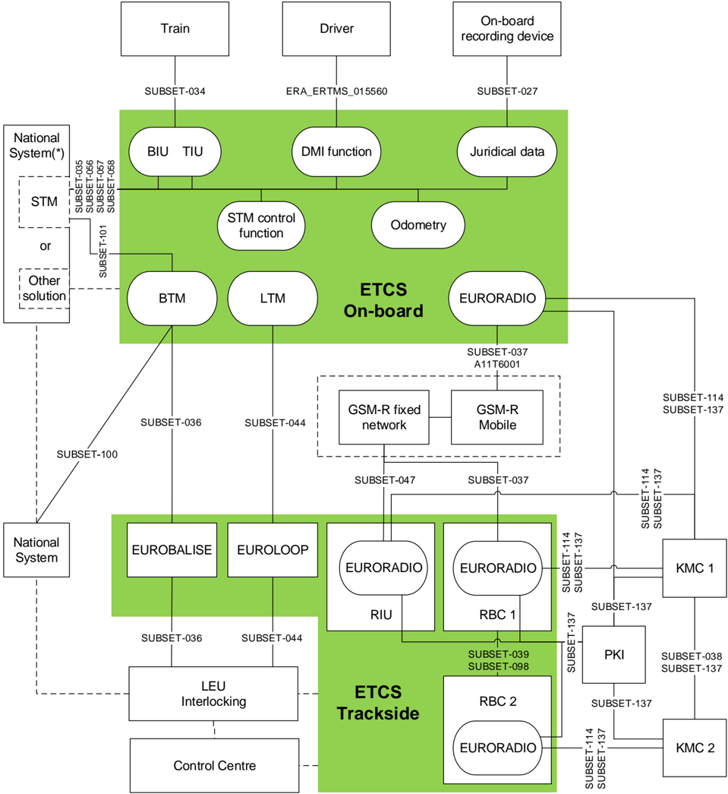
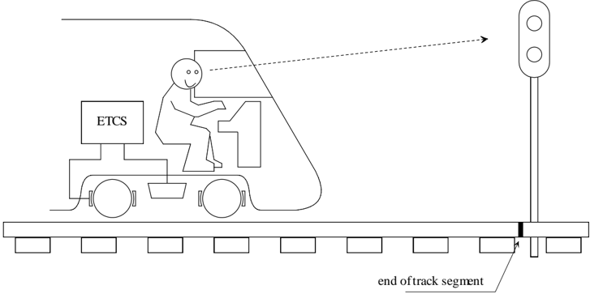
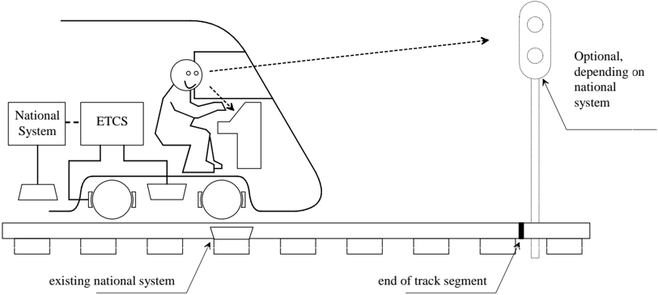
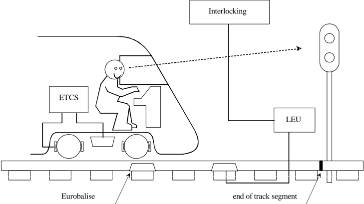
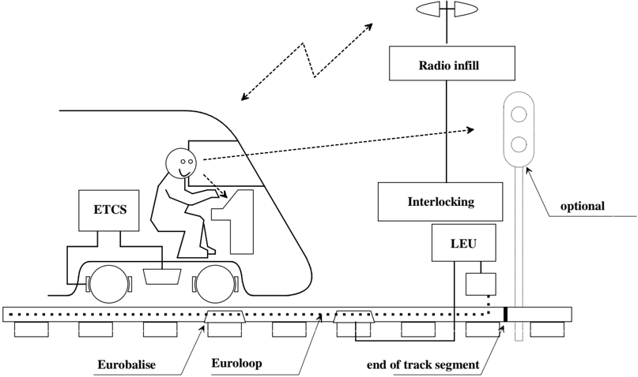
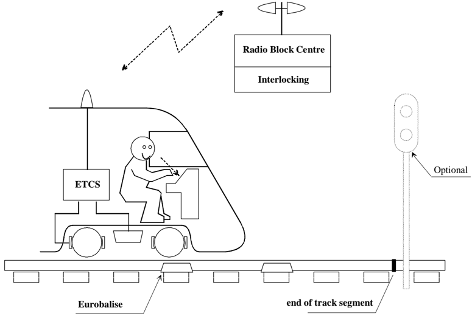
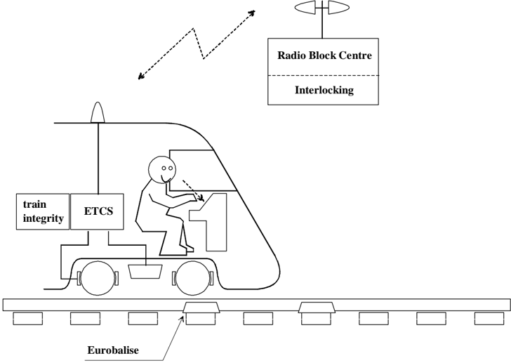

---
<!-- pagina 1 -->

# ERTMS/ETCS [¶0]

System Requirements Specification Chapter 2 Basic System Description [¶1]

REF : [¶2]

SUBSET-026-2 [¶3]

ISSUE : [¶4]

3.6.0 [¶5]

DATE  : [¶6]

13/05/2016 [¶7]

---
<!-- pagina 2 -->

# ERA * UNISIG * EEIG ERTMS USERS GROUP [¶8]

# 2.1 Modification History [¶9]

[¶10]
| Issue Number Date   | Section Number                                                            | Modification / Description                                                    | Author       |
|---------------------|---------------------------------------------------------------------------|-------------------------------------------------------------------------------|--------------|
| 0.0.1 19 july 1999  | All                                                                       | First class 1 draft using new templates and including contributions from WPs  | PZ           |
| 0.1.0 26 july 1999  | System architecture figure § 2.3.1.2                                      | Updating and introduction of Radio infill Reference to future class 1 deleted | PZ           |
| 1.0.0 29 July 1999  | Document version, editorial changes, updating the architecture figure.    | Finalisation in Stuttgart 990729                                              | HE           |
| 1.2.0 990730        | Version number                                                            | Release version                                                               | HE           |
| 1.2.1 991209        | All                                                                       | Draft for 2 nd release                                                        | SAB          |
| 1.3.0 9912016       | All                                                                       | Review comments added                                                         | SAB          |
| 2.0.0 991222        | Minor editing                                                             | Finalisation                                                                  | SAB          |
| 2.0.1               | All                                                                       | Corrections after review                                                      | SAB          |
| 2.1.0               | Minor editing                                                             | UNISIG release                                                                | SAB          |
| 2.2.0               | Version number                                                            | UNISIG release                                                                | SAB          |
| 2.2.2 1.2.2002      | Version number                                                            | Final edition                                                                 | Ch. Frerichs |
| 2.3.0 24/02/06      | Version number No change since 2.2.2                                      | Release version                                                               | HK           |
| 2.3.2 17/03/08      | Including CRs that are in state 'Analysis completed' according to ERA CCM | Working version                                                               | AH           |
| 3.0.0 23/12/08      | Version number No change since 2.3.2                                      | Release version                                                               | AH           |

---
<!-- pagina 3 -->

# ERA * UNISIG * EEIG ERTMS USERS GROUP [¶11]

[¶12]
| 3.0.1 22/12/09   |                                                                                 | Including the results of the editorial review of the SRS 3.0.0 and the other error CR's that are in state 'Analysis completed' according to ERA CCM   | AH   |
|------------------|---------------------------------------------------------------------------------|-------------------------------------------------------------------------------------------------------------------------------------------------------|------|
| 3.1.0 22/02/10   |                                                                                 | Release version                                                                                                                                       | AH   |
| 3.1.1 08/11/10   |                                                                                 | Including all CR's that are in state 'Analysis completed' according to ERA CCM                                                                        | AH   |
| 3.2.0 22/12/10   | No change                                                                       | Release version                                                                                                                                       | AH   |
| 3.2.1 13/12/11   |                                                                                 | Including all CR's that are in state 'Analysis completed' according to ERA CCM                                                                        | AH   |
| 3.3.0 07/03/12   |                                                                                 | Baseline 3 release version                                                                                                                            | AH   |
| 3.3.1 04/04/14   | No change                                                                       |                                                                                                                                                       | OG   |
| 3.3.2 23/04/14   | No change                                                                       | Baseline 3 1 st maintenance pre-release version                                                                                                       | OG   |
| 3.3.3 06/05/14   | No change                                                                       | Baseline 3 1 st maintenance 2 nd pre-release version                                                                                                  | OG   |
| 3.4.0 12/05/14   | No change                                                                       | Baseline 3 1 st maintenance release version                                                                                                           | OG   |
| 3.4.1 23/06/15   | CR1236                                                                          |                                                                                                                                                       | OG   |
| 3.4.2 17/11/15   | CR's 1237, 1265                                                                 |                                                                                                                                                       | OG   |
| 3.4.3 16/12/15   | No change                                                                       |                                                                                                                                                       | OG   |
| 3.5.0 18/12/15   | Baseline 3 2 nd release version as recommended to EC (see ERA-REC-123-2015/REC) | Baseline 3 2 nd release version as recommended to EC (see ERA-REC-123-2015/REC)                                                                       | AH   |
| 3.5.1 28/04/16   | No change                                                                       |                                                                                                                                                       | OG   |

---
<!-- pagina 4 -->

[¶13]
| 3.6.0    | Baseline 3 2 nd release version   | AH   |
|----------|-----------------------------------|------|
| 13/05/16 |                                   |      |

---
<!-- pagina 5 -->

# 2.2 Table of Contents [¶14]

| 2.1                                                                                                                          | Modification History...........................................................................................................2     | Modification History...........................................................................................................2     |
|------------------------------------------------------------------------------------------------------------------------------|--------------------------------------------------------------------------------------------------------------------------------------|--------------------------------------------------------------------------------------------------------------------------------------|
| 2.2                                                                                                                          | Table of Contents..............................................................................................................5     | Table of Contents..............................................................................................................5     |
| 2.3                                                                                                                          | Introduction.......................................................................................................................6 | Introduction.......................................................................................................................6 |
| 2.3.1 Scope and purpose....................................................................................................6 | 2.3.1 Scope and purpose....................................................................................................6         |                                                                                                                                      |
| 2.4                                                                                                                          | System structure...............................................................................................................7     | System structure...............................................................................................................7     |
| 2.5                                                                                                                          | Subsystems ......................................................................................................................8   | Subsystems ......................................................................................................................8   |
| 2.5.1                                                                                                                        | 2.5.1                                                                                                                                | Trackside subsystem .................................................................................................8               |
| 2.5.2                                                                                                                        | 2.5.2                                                                                                                                | On-board subsystem..................................................................................................9                |
| 2.5.3                                                                                                                        | 2.5.3                                                                                                                                | ERTMS/ETCS reference architecture ......................................................................11                           |
| 2.6                                                                                                                          | Levels and transitions .....................................................................................................12       | Levels and transitions .....................................................................................................12       |
| 2.6.1                                                                                                                        | 2.6.1                                                                                                                                | Introduction..............................................................................................................12         |
| 2.6.2                                                                                                                        | 2.6.2                                                                                                                                | Definitions................................................................................................................12        |
| 2.6.3                                                                                                                        | 2.6.3                                                                                                                                | ERTMS/ETCS Application Level 0 ...........................................................................14                         |
| 2.6.4                                                                                                                        | 2.6.4                                                                                                                                | ERTMS/ETCS Application Level NTC......................................................................16                             |
| 2.6.5                                                                                                                        | 2.6.5                                                                                                                                | ERTMS/ETCS Application Level 1 ...........................................................................18                         |
| 2.6.6                                                                                                                        | 2.6.6                                                                                                                                | ERTMS/ETCS Application Level 2 ...........................................................................21                         |
| 2.6.7                                                                                                                        | 2.6.7                                                                                                                                | ERTMS/ETCS Application Level 3 ...........................................................................23                         |
| 2.6.8                                                                                                                        | 2.6.8                                                                                                                                | Level transitions.......................................................................................................25           | [¶15]

---
<!-- pagina 6 -->

# 2.3 Introduction [¶16]

# 2.3.1 Scope and purpose [¶17]

- 2.3.1.1 The  present  chapter  gives  the  basic  description  of  the ERTMS/ETCS  system proposed to achieve technical interoperability. [¶18]

---
<!-- pagina 7 -->

# 2.4 System structure [¶19]

- 2.4.1.1 Due to the nature of the required functions, the ERTMS/ETCS system will have to be partly on the trackside and partly on board the trains. [¶20]

- 2.4.1.2 This defines two subsystems, the on-board subsystem and the trackside subsystem. [¶21]

- 2.4.1.3 The environment of ERTMS/ETCS system is composed of: [¶22]

- the train, which will then be considered in the train interface specification; [¶23]

- the driver, which will then be considered via the driver interface specification; [¶24]

-  other onboard interfaces (see architecture drawing in 2.5.3), [¶25]

- external  trackside  systems  (interlockings,  control  centres,  etc.),  for  which  no interoperability requirement will be established. [¶26]

---
<!-- pagina 8 -->

# 2.5 Subsystems [¶27]

# 2.5.1 Trackside subsystem [¶28]

- 2.5.1.1 Depending of the application level (see further sections), the trackside subsystem can be composed of: [¶29]

- balise [¶30]

- lineside electronic unit [¶31]

-  the radio communication network (GSM-R) [¶32]

- the Radio Block Centre (RBC) [¶33]

- Euroloop [¶34]

-  Radio infill unit [¶35]

- Key Management Centre (KMC) [¶36]

- Public Key Infrastructure (PKI) [¶37]

# 2.5.1.2 Balise [¶38]

- 2.5.1.2.1 The  balise  is  a  transmission  device  that  can  send  telegrams  to  the  on-board subsystem. [¶39]

- 2.5.1.2.2 The balise  is  based  on  the  existing  Eurobalise  specifications.  These  documents  are included in the frame of the ERTMS/ETCS specifications. [¶40]

- 2.5.1.2.3 The balises provides the up-link, i. e. the possibility to send messages from trackside to the on-board subsystem. [¶41]

- 2.5.1.2.4 The balises can provide fixed messages or, when connected to a lineside electronic unit, messages that can be changed. [¶42]

- 2.5.1.2.5 The balises will be organised in groups, each balise transmitting a telegram and the combination of all telegrams defining the message sent by the balise group. [¶43]

# 2.5.1.3 Lineside electronic unit [¶44]

- 2.5.1.3.1 The lineside electronic units are electronic devices, that generate telegrams to be sent by balises, on basis of information received from external trackside systems. [¶45]

# 2.5.1.4 Trackside radio communication network (GSM-R) [¶46]

- 2.5.1.4.1 The GSM-R radio communication network is used for the bi-directional exchange of messages between on-board subsystems and RBC or radio infill units. [¶47]

# 2.5.1.4.2 Intentionally deleted

# 2.5.1.5 RBC [¶48]

---
<!-- pagina 9 -->

- 2.5.1.5.1 The RBC is a computer-based system that elaborates messages to be sent to the train on  basis  of  information  received  from  external  trackside  systems  and  on  basis  of information exchanged with the on-board subsystems. [¶49]

- 2.5.1.5.2 The main objective of these messages is to provide movement authorities to allow the safe movement of trains on the Railway infrastructure area under the responsibility of the RBC. [¶50]

- 2.5.1.5.3 The interoperability requirements for the RBC are mainly related to the data exchange between the RBC and the on-board subsystem. [¶51]

# 2.5.1.6 Euroloop [¶52]

- 2.5.1.6.1 The Euroloop subsystem operates on Level 1 lines, providing signalling information in advance as regard to the next main signal in the train running direction. [¶53]

- 2.5.1.6.2 The Euroloop subsystem is composed of an on-board functionality and by one or more trackside parts. [¶54]

# 2.5.1.7 Radio infill Unit [¶55]

- 2.5.1.7.1 The  RADIO  INFILL  subsystem  operates  on  Level  1  lines,  providing  signalling information in advance as regard to the next main signal in the train running direction. [¶56]

- 2.5.1.7.2 The RADIO INFILL subsystem is composed of an on-board functionality and by one or more trackside parts (named RADIO INFILL Unit). [¶57]

# 2.5.1.8 KMC [¶58]

- 2.5.1.8.1 The role of the KMC is to manage the cryptographic keys, which are used to secure the EURORADIO communications between the ERTMS/ETCS entities (ERTMS/ETCS on-board equipments, RBCs and RIUs). [¶59]

# 2.5.1.9 PKI [¶60]

- 2.5.1.9.1 The role  of  the  PKI  is  to  manage  and  distribute  digital  certificates,  so  as  to  allow  a secure on-line distribution of cryptographic keys between KMCs and from a KMC to the ERTMS/ETCS entities (ERTMS/ETCS on-board equipments, RBCs and RIUs). [¶61]

# 2.5.2 On-board subsystem [¶62]

- 2.5.2.1 Depending of the application level (see further sections), the on-board subsystem can be composed of: [¶63]

- the ERTMS/ETCS on-board equipment; [¶64]

- the on-board part of the GSM-R radio system; [¶65]

# 2.5.2.2 ERTMS/ETCS on-board equipment [¶66]

---
<!-- pagina 10 -->

# ERA * UNISIG * EEIG ERTMS USERS GROUP [¶67]

- 2.5.2.2.1 The ERTMS/ETCS on-board equipment is a computer-based system that supervises the movement of the train to which it belongs, on basis of information exchanged with the trackside subsystem. [¶68]

- 2.5.2.2.2 The  interoperability  requirements  for  the  ERTMS/ETCS  on-board  equipment  are related to the functionality and the data exchange between the trackside subsystems and  the  on-board  subsystem  and  to  the  functional  data  exchange  between  the  onboard subsystem and: [¶69]

- the driver; [¶70]

- the train; [¶71]

-  the onboard part of the existing national train control system(s). [¶72]

# 2.5.2.3 Onboard radio communication system (GSM-R) [¶73]

- 2.5.2.3.1 The  GSM-R  on-board  radio  system  is  used  for  the  bi-directional  exchange  of messages between on-board subsystem and RBC or radio infill unit. [¶74]

- 2.5.2.3.2 Intentionally deleted. [¶75]

---
<!-- pagina 11 -->

# ERA * UNISIG * EEIG ERTMS USERS GROUP [¶76]

# 2.5.3 ERTMS/ETCS reference architecture [¶77]

# Figure 1: ERTMS/ETCS system and its interfaces [¶78]

- 2.5.3.1 Note: the entities inside the ERTMS/ETCS on-board equipment box are shown only to highlight the scope of the interfaces that are specified in the TSI CCS annex A. [¶79]

---
<!-- pagina 12 -->

# 2.6 Levels and transitions [¶80]

# 2.6.1 Introduction [¶81]

- 2.6.1.1 The different ERTMS/ETCS application levels (short: levels) are a way to express the possible operating relationships between track and train. Level definitions are related to  the  trackside  equipment  used,  to  the  way  trackside  information  reaches  the  onboard units and to which functions are processed in the trackside and in the on-board equipment respectively. [¶82]

- 2.6.1.2 Different  levels  have  been  defined  to  allow  each  individual  railway  administration  to select the appropriate ERTMS/ETCS  application trackside, according to their strategies, to their trackside infrastructure and to the required performance. Furthermore,  the different application levels permit the interfacing of individual signalling systems and train control systems to ERTMS/ETCS. [¶83]

- 2.6.1.3 For the purpose of a consistent specification a level 0 has been defined. This level is used  for  operation  on  non-equipped  (unfitted)  lines  or  on  lines  equipped  with  train control system(s) but operation under their supervision is currently not possible. [¶84]

# 2.6.2 Definitions [¶85]

- 2.6.2.1 A train equipped with ERTMS/ETCS on-board equipment always co-operates with the ERTMS/ETCS trackside equipment in a defined ERTMS/ETCS level. [¶86]

- 2.6.2.2 All transitions between levels are performed according to well-specified rules. [¶87]

- 2.6.2.3 ERTMS/ETCS can be configured to operate in one of the following application levels: [¶88]

-  ERTMS/ETCS Level 0 (train equipped with ERTMS/ETCS operating on a line not equipped with any train control system (ERTMS/ETCS or national system) or on a line  equipped  with  ERTMS/ETCS  and/or  national  system(s)  but  operation  under their supervision is currently not possible) [¶89]

-  ERTMS/ETCS Level NTC (train equipped with ERTMS/ETCS operating on a line equipped with a national system) [¶90]

-  ERTMS/ETCS Application Level 1 with or without infill transmission (train equipped with  ERTMS/ETCS  operating  on  a  line  equipped  with  Eurobalises  and  optionally Euroloop or Radio infill) [¶91]

-  ERTMS/ETCS Application Level 2 (train equipped with ERTMS/ETCS operating on a  line  controlled  by  a  Radio  Block  Centre  and  equipped  with  Eurobalises  and Euroradio) with train position and train integrity proving performed by the trackside [¶92]

-  ERTMS/ETCS Application Level 3 (similar to level 2 but with train position and train integrity supervision based on information received from the train) [¶93]

---
<!-- pagina 13 -->

- 2.6.2.4 It is possible to superimpose several application levels in parallel on the same track, for example  to  run  trains  without  train  integrity  device  in  level  2  and  in  parallel  trains equipped with train integrity device in level 3. Other examples might be a station which is shared by trains arriving over level 1 and level 2 lines (junctions) or parallel operation of a national system with ERTMS/ETCS. Mixed levels are supported. [¶94]

- 2.6.2.5 Intentionally deleted. [¶95]

- 2.6.2.6 Intentionally deleted. [¶96]

- 2.6.2.7 It  is  possible  to  transmit  information  not  intended  for  ERTMS/ETCS  but  for  other systems over the ERTMS/ETCS transmission channels. This information is not used by ERTMS/ETCS. [¶97]

---
<!-- pagina 14 -->

# 2.6.3 ERTMS/ETCS Application Level 0 [¶98]

# 2.6.3.1 General description [¶99]

- 2.6.3.1.1 Level 0 covers operation of ETCS equipped trains on lines not equipped with ETCS or national  systems  or  on  lines  where  trackside  ERTMS/ETCS  infrastructure  and/or national  systems  may  exist  but  operation  under  their  supervision  is  currently  not possible (e.g. commissioning or on-board/trackside failed components). [¶100]

- 2.6.3.1.2 In  Level  0  it  is  authorized  to  operate  trains  without  any  train  control  system  and therefore  line  side  optical  signals  or  other  means  of  signalling  are  used  to  give movement authorities to the driver. [¶101]

- 2.6.3.1.3 ERTMS/ETCS on-board equipment provides no supervision except of  the  maximum design speed of a train and maximum speed permitted in unfitted areas. [¶102]

- 2.6.3.1.4 Train detection and  train integrity supervision are performed  by  the trackside equipment of the underlying signalling system (interlocking, track circuits etc.) and are outside the scope of ERTMS/ETCS. [¶103]

- 2.6.3.1.5 Level  0  uses  no  track-train  transmission  except  Eurobalises  to  announce/command level  transitions.  Eurobalises  therefore  still  have  to  be  read.  No  balise  data  except certain special commands are interpreted. [¶104]

- 2.6.3.1.6 No supervisory information is indicated on the DMI except the train speed. Train data has  to  be  entered  in  order  not  to  have  to  stop  a  train  at  a  level  transition  to ERTMS/ETCS equipped area and to supervise maximum train speed. [¶105]

# Figure 2: ERTMS/ETCS Application Level 0 [¶106]

# 2.6.3.2 Summary of characteristics of Application Level 0 [¶107]

# 2.6.3.2.1 Trackside equipment: [¶108]

---
<!-- pagina 15 -->

-  No ERTMS/ETCS trackside equipment is used except for Eurobalises to announce level transitions and other specific commands. [¶109]

- 2.6.3.2.2 Main ERTMS/ETCS trackside functions: [¶110]

-  None. [¶111]

- 2.6.3.2.3 On-board equipment: [¶112]

-  Onboard equipment with Eurobalise transmission. [¶113]

- 2.6.3.2.4 Main ERTMS/ETCS on-board functions: [¶114]

-  Supervision of maximum train speed. [¶115]

-  Supervision of maximum speed permitted in an unfitted area. [¶116]

-  Reading of Eurobalises to detect level transitions and certain special commands. All other messages are rejected. [¶117]

-  No cab signalling. [¶118]

---
<!-- pagina 16 -->

# 2.6.4 ERTMS/ETCS Application Level NTC [¶119]

# 2.6.4.1 General description [¶120]

- 2.6.4.1.1 Level  NTC  is  used  to  run  ERTMS/ETCS  equipped  trains  on  lines  equipped  with national train control and speed supervision systems. [¶121]

- 2.6.4.1.2 Train  control  information  generated  trackside  by  the  national  train  control  system  is transmitted  to  the  train  via  the  communication  channels  of  the  underlying  national system. [¶122]

- 2.6.4.1.3 Note: Lineside optical signals might be necessary or not, depending on the performance and functionality of the underlying systems. [¶123]

- 2.6.4.1.4 Intentionally deleted. [¶124]

- 2.6.4.1.5 The  achievable  level  of  supervision  is  similar  to  the  one  provided  by  the  underlying national systems. [¶125]

- 2.6.4.1.6 Train detection and train integrity supervision are performed by equipment external to ERTMS/ETCS. [¶126]

- 2.6.4.1.7 Level NTC uses no ERTMS/ETCS track-train information except to announce/command  level transitions and specific commands  related to balise transmission. Eurobalises therefore still have to be read. [¶127]

- 2.6.4.1.8 The information displayed to the driver depends on the functionality of the underlying national  system.  The  active  national  system  is  indicated  to  the  driver  as  part  of  that information. Full train data has to be entered in order not to have to stop a train at a level transition position and to supervise maximum train speed. [¶128]

- 2.6.4.1.9 A combination of national systems can be regarded as one NTC level. [¶129]

- 2.6.4.1.10  Depending  on  the  functionality  and  the  configuration  of  the  specific  national  system installed onboard, the ERTMS/ETCS Onboard system may need to be interfaced to it, in order to perform the transitions from/to the national system and/or in order to give access to ERTMS/ETCS Onboard resources (e.g. DMI). This can be achieved through a device called an STM (Specific Transmission Module) using a standardised interface. [¶130]

- 2.6.4.1.11  Intentionally deleted. [¶131]

---
<!-- pagina 17 -->

# ERA * UNISIG * EEIG ERTMS USERS GROUP [¶132]

# Figure 3: ERTMS/ETCS Application Level NTC [¶133]

# 2.6.4.2 Summary of characteristics of Application Level NTC [¶134]

- 2.6.4.2.1 Trackside equipment: [¶135]

-  Level  NTC  uses  the  track-train  transmission  system  from  an  underlying  national system, which is not part of ERTMS/ETCS. [¶136]

-  For level transition purposes Eurobalises are used. [¶137]

- 2.6.4.2.2 Main ERTMS/ETCS trackside functions: [¶138]

-  None. [¶139]

- 2.6.4.2.3 On-board equipment: [¶140]

-  Onboard equipment with Eurobalise transmission. [¶141]

-  Onboard part of the national system. [¶142]

- 2.6.4.2.4 Main ERTMS/ETCS on-board function: [¶143]

-  No train supervision, it is fully handed over to the national system. [¶144]

-  Reading of Eurobalises to detect level transitions and certain special commands. All other messages are rejected. [¶145]

-  Management of the national system through STM, in case the ERTMS/ETCS onboard equipment is interfaced to the national system through an STM. [¶146]

---
<!-- pagina 18 -->

# ERA * UNISIG * EEIG ERTMS USERS GROUP [¶147]

-  No cab signalling. [¶148]

# 2.6.5 ERTMS/ETCS Application Level 1 [¶149]

# 2.6.5.1 General description [¶150]

- 2.6.5.1.1 ERTMS/ETCS Level 1 is a spot transmission based train control system to be used as an overlay on an underlying signalling system. [¶151]

- 2.6.5.1.2 Movement  authorities  are  generated  trackside  and  are  transmitted  to  the  train  via Eurobalises. [¶152]

- 2.6.5.1.3 ERTMS/ETCS Level 1 provides a continuous speed supervision  system,  which  also protects against overrun of the authority. [¶153]

- 2.6.5.1.4 Train detection and  train integrity supervision are performed  by  the trackside equipment of the underlying signalling system (interlocking, track circuits etc.) and are outside the scope of ERTMS/ETCS. [¶154]

- 2.6.5.1.5 Level 1 is based on Eurobalises as spot transmission devices. [¶155]

- 2.6.5.1.6 The trackside equipment does not know the train to which it sends information. [¶156]

- 2.6.5.1.7 If  in  level  1  a  lineside  signal  clears,  an  approaching  train  can  not  receive  this information until it passes the Eurobalise group at that signal. The driver therefore has to  observe  the  lineside  signal  to  know  when  to  proceed.  The  train  has  then  to  be permitted  to  approach  the  stopping  location  below  a  maximum  permitted  release speed. [¶157]

- 2.6.5.1.8 Additional Eurobalises can be placed between distant and main signals to transmit infill information, the train will receive new information before reaching the signal. [¶158]

- 2.6.5.1.9 Note: Lineside signals are required in level 1 applications, except if semi-continuous infill is provided. [¶159]

- 2.6.5.1.10  Semi-continuous infill can be provided using Euroloop or radio infill. In this case, the on-board system will  be  able  to  show  new  information  to  the  driver  as  soon  as  it  is available and even at standstill. [¶160]

- 2.6.5.1.11  Euroloop or radio infill  can  improve  the  safety  of  a  level  1  system  as  they  allow  the operation without release speed. [¶161]

---
<!-- pagina 19 -->

# ERA * UNISIG * EEIG ERTMS USERS GROUP [¶162]

Figure 4: ERTMS/ETCS Application Level 1 without infill function [¶163]

Figure 5: ERTMS/ETCS Application Level 1 with infill function by Euroloop or Radio infill [¶164]

---
<!-- pagina 20 -->

# 2.6.5.2 Summary of characteristics of Application Level 1 [¶165]

- 2.6.5.2.1 Trackside equipment: [¶166]

-  Eurobalises for spot transmission from track to train. [¶167]

-  Eurobalises must be able to transmit variable information. [¶168]

-  Semi continuous infill transmission by using Euroloop or radio infill is optional. [¶169]

- 2.6.5.2.2 Main ERTMS/ETCS trackside function: [¶170]

-  Determine movement authorities according to the underlying signalling system. [¶171]

-  Transmit movement authorities and track description data to the train. [¶172]

- 2.6.5.2.3 On-board equipment: [¶173]

-  Onboard equipment with Eurobalise transmission. [¶174]

-  Euroloop transmission if infill by Euroloop is required. [¶175]

-  Radio infill transmission if infill by radio is required. [¶176]

- 2.6.5.2.4 Main ERTMS/ETCS on-board function: [¶177]

-  Reception of  movement authority and track description related to the transmitting balise. [¶178]

-  Selection  of  the  most  restrictive  value  of  the  different  speeds  permitted  at  each location ahead. [¶179]

-  Calculation of a dynamic speed profile taking into account the train running/braking characteristics which are known on-board and the track description data. [¶180]

-  Comparison of  the  train  speed  with  the  permitted  speed  and  commanding  of  the brake application if necessary. [¶181]

-  Cab signalling to the driver. [¶182]

---
<!-- pagina 21 -->

# 2.6.6 ERTMS/ETCS Application Level 2 [¶183]

# 2.6.6.1 General description [¶184]

- 2.6.6.1.1 ERTMS/ETCS  Level  2  is  a  radio  based  train  control  system  which  is  used  as  an overlay on an underlying signalling system. [¶185]

- 2.6.6.1.2 Movement  authorities  are  generated  trackside  and  are  transmitted  to  the  train  via Euroradio. [¶186]

- 2.6.6.1.3 ERTMS/ETCS Level 2 provides a continuous speed supervision  system,  which  also protects against overrun of the authority. [¶187]

- 2.6.6.1.4 Train detection and  train integrity supervision are performed  by  the trackside equipment of the underlying signalling system (interlocking, track circuits etc.) and are outside the scope of ERTMS/ETCS. [¶188]

- 2.6.6.1.5 Level 2 is based on Euroradio for track to train communication and on Eurobalises as spot transmission devices mainly for location referencing. [¶189]

- 2.6.6.1.6 The  trackside  radio  block  centre  which  provides  the  information  to  the  trains  knows each  ERTMS/ETCS  controlled  train  individually  by  the  ERTMS/ETCS  identity  of  its leading ERTMS/ETCS on-board equipment. [¶190]

- 2.6.6.1.7 Note: Lineside signals can be suppressed in Level 2. [¶191]

Figure 6: ERTMS/ETCS Application Level 2 [¶192]

---
<!-- pagina 22 -->

# 2.6.6.2 Summary of characteristics of Application Level 2 [¶193]

- 2.6.6.2.1 Trackside equipment: [¶194]

-  Radio block centre. [¶195]

-  Euroradio for bi-directional track-train communication. [¶196]

-  Eurobalises mainly for location referencing. [¶197]

- 2.6.6.2.2 Main ERTMS/ETCS trackside function: [¶198]

-  Knowing each train equipped with and running under ERTMS/ETCS within an RBC area by its ERTMS/ETCS identity. [¶199]

-  Following each ERTMS/ETCS controlled train's location within an RBC area. [¶200]

-  Determine movement authorities according to the underlying signalling system for each train individually. [¶201]

-  Transmit movement authorities and track description  to each train individually. [¶202]

-  Handing over of train control between different RBC's at the RBC-RBC borders. [¶203]

- 2.6.6.2.3 On-board equipment: [¶204]

-  Onboard equipment with Eurobalise and Euroradio transmissions. [¶205]

- 2.6.6.2.4 Main ERTMS/ETCS on-board function: [¶206]

-  The train reads Eurobalises and sends its position relative to the detected balises to the radio block centre. [¶207]

-  The train  receives  a  movement  authority  and  the  track  description    via  Euroradio relating to a balise. [¶208]

-  Selection  of  the  most  restrictive  value  of  the  different  speeds  permitted  at  each location ahead. [¶209]

-  Calculation of a dynamic speed profile taking into account the train running/braking characteristics which are known on-board and the track description data. [¶210]

-  Comparison of  the  train  speed  with  the  permitted  speed  and  commanding  of  the brake application if necessary. [¶211]

-  Cab signalling to the driver. [¶212]

---
<!-- pagina 23 -->

# ERA * UNISIG * EEIG ERTMS USERS GROUP [¶213]

# 2.6.7 ERTMS/ETCS Application Level 3 [¶214]

# 2.6.7.1 General description [¶215]

- 2.6.7.1.1 ERTMS/ETCS Level 3 is a radio based train control system. [¶216]

- 2.6.7.1.2 Movement  authorities  are  generated  trackside  and  are  transmitted  to  the  train  via Euroradio. [¶217]

- 2.6.7.1.3 ERTMS/ETCS Level 3 provides a  continuous  speed  supervision  system,  which  also protects against overrun of the authority. [¶218]

- 2.6.7.1.4 Train position and train integrity supervision are performed by the trackside radio block centre  in  co-operation  with  the  train  (which  sends  position  reports  and  train  integrity information). [¶219]

- 2.6.7.1.5 Level 3 is based on Euroradio for track to train communication and on Eurobalises as spot transmission devices mainly for location referencing. [¶220]

- 2.6.7.1.6 The  trackside  radio  block  centre  which  provides  the  information  to  the  trains  knows each train individually  by  the  ERTMS/ETCS identity of its leading ERTMS/ETCS onboard equipment. [¶221]

- 2.6.7.1.7 Note: Lineside signals are not foreseen to be used when operating in Level 3. [¶222]

# Figure 7: ERTMS/ETCS Application Level 3 [¶223]

# 2.6.7.2 Summary of characteristics of Application Level 3 [¶224]

---
<!-- pagina 24 -->

- 2.6.7.2.1 Trackside equipment: [¶225]

-  Radio block centre. [¶226]

-  Euroradio for bi-directional track-train communication. [¶227]

-  Eurobalises for mainly location referencing. [¶228]

- 2.6.7.2.2 Main ERTMS/ETCS trackside function: [¶229]

-  Knowing each train within an RBC area by its ERTMS/ETCS identity. [¶230]

-  Following each trains location within an RBC area. [¶231]

-  Route locking and route releasing based on information received from the trains. [¶232]

-  Determine movement authorities for each train individually. [¶233]

-  Transmit movement authorities and track description  to each train individually. [¶234]

-  Handing over of train control between different RBC's at the RBC-RBC borders. [¶235]

- 2.6.7.2.3 On-board equipment: [¶236]

-  Onboard equipment with Eurobalise and Euroradio transmissions. [¶237]

-  Train integrity proving system. [¶238]

- 2.6.7.2.4 Main ERTMS/ETCS on-board functions: [¶239]

-  The train reads Eurobalises and sends its position relative to the detected balises to the radio block centre. [¶240]

-  The train monitors train integrity (external function, not part of ERTMS/ETCS) and sends this information to the radio block centre. [¶241]

-  The train  receives  a  movement  authority  and  the  track  description    via  Euroradio relating to a balise. [¶242]

-  Selection  of  the  most  restrictive  value  of  the  different  speeds  permitted  at  each location ahead. [¶243]

-  Calculation of a dynamic speed profile, taking into account the train running/braking characteristics which are known on-board and the track description data. [¶244]

-  Comparison of  the  train  speed  with  the  permitted  speed  and  commanding  of  the brake application if necessary. [¶245]

-  Cab signalling to the driver. [¶246]

---
<!-- pagina 25 -->

# 2.6.8 Level transitions [¶247]

- 2.6.8.1 An ERTMS/ETCS equipment which is not isolated always operates in one of the above described  levels.  All  transitions  between  these  levels  are  performed  according  to defined functions and procedures. [¶248]

- 2.6.8.2 Additional national functions and rules which might be used by an individual railway to for  example  prevent  not  equipped  trains  from  entering  a  level  2/3  area  are  not specified here and have to be implemented outside ERTMS/ETCS. [¶249]

- 2.6.8.3 The following table shows all possible transitions (marked with Grey): [¶250]

[¶251]
| to   | 0   | NTC   | 1   | 2   | 3   |
|------|-----|-------|-----|-----|-----|
| from |     |       |     |     |     |
| 0    |     |       |     |     |     |
| NTC  |     | a)    |     |     |     |
| 1    |     |       |     |     |     |
| 2    |     |       |     | b)  |     |
| 3    |     |       |     |     | b)  |

# Table 1: Possible level transitions. [¶252]

- Transitions  between  level  NTC  and  level  NTC  describe  the  switching  from  one national system to another national system. [¶253]

- Transitions  between  level  2  and  level  2  respectively  between  level  3  and  level  3 describe the handover between RBC's. [¶254]
